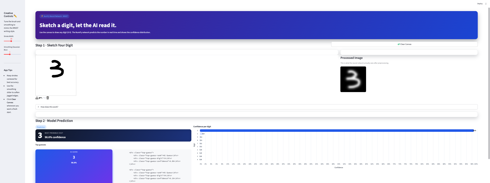

---

# 🔥 Neural Network from Scratch (Interactive Web App)

An end-to-end implementation of a **fully connected neural network built entirely from scratch using NumPy**, paired with a polished, fully interactive **Streamlit web app** where users can *sketch a digit* and watch the neural network classify it in real time.

This app replicates the MNIST preprocessing pipeline visually: inversion, resizing, smoothing, grayscale conversion, and then displays model confidence scores beautifully.

Includes:

* A custom NumPy-based neural network (forward + backward propagation)
* Softmax classification with cross-entropy loss
* Gradient descent optimization
* MNIST preprocessing pipeline
* Interactive digit sketching canvas
* Real-time model predictions
* Probability distribution chart
* Clean UI with creative controls (stroke width + smoothing)
* “How this works” collapsible explanation

This project is designed for learners who want to go beyond frameworks and understand how neural networks actually operate internally.

---


---

## 🚀 Features

### 🧠 Core Algorithm

* Fully connected neural network written manually with **NumPy**
* Supports: ReLU, Sigmoid, Tanh, Leaky ReLU
* Softmax output layer (10 classes)
* Cross-entropy loss
* Forward + Backward propagation
* Gradient descent with weight/bias updates
* He/Xavier initialization
* One-hot encoding
* Accuracy evaluation

### 🎨 Web App (Frontend)

The Streamlit interface is designed to mimic the MNIST writing style and provide extremely intuitive feedback.

Includes:

* ✏️ **Digit sketch canvas** powered by `streamlit-drawable-canvas`
* 🎚 **Creative Controls sidebar**:

  * Stroke width slider
  * Gaussian smoothing slider (mimics MNIST style)
* 🧼 **Clear Canvas** button
* 🖼 **Processed Image Preview** (what the model actually sees)
* 📉 **Probability distribution chart** for confidence breakdown
* 📊 **Top guesses section** (ranked with confidence)
* 📘 **"How does this work?"** collapsible explanation panel

This frontend is highly polished and clearly explains every step of the classification pipeline.

### 📊 Visualizations

* Model confidence bar chart
* Ranked top guesses
* Preprocessed digit preview (28×28 smoothed grayscale)
* Collapsible explanations to educate users on pipeline steps

---

## 🗂️ Project Structure

Neural_Net_Project/
│
├── app.py # Streamlit digit classifier UI
├── neural_net.py # Full neural network implementation (NumPy)
├── mnist_weights.npz # Saved trained weights
├── requirements.txt # Dependencies
└── README.md # Documentation
---

## 📘 How the Neural Network Works

### 🧮 Initialization

* Weights initialized with He/Xavier strategy
* Biases initialized to zero
* Architecture: **784 → 128 → 32 → 10**

### 🔄 Training Loop

1. Load and normalize MNIST
2. Forward pass
3. Backward pass (manual gradients)
4. Weight + bias updates (gradient descent)
5. Track cost per epoch
6. Compute train/test accuracy

### 📈 Metrics

* Accuracy
* Cost curve
* Confusion matrix
* Misclassified sample display (in training script)

---

## 🛠 Installation

```
pip install -r requirements.txt
```

---

## 🏋️ Train the Model

```
python neural_net.py
```

This downloads MNIST, trains the model, and saves weights to:

```
mnist_weights.npz
```

---

## 🎨 Run the Web App

```
streamlit run app.py
```

The app will open automatically. Sketch any digit (0–9) and the neural network will classify it in real time.

---

## 👤 Author

**Ghassan Al-Kurd**
Software Engineering & Finance Student

* GitHub: [https://github.com/GhassanAlKurd](https://github.com/GhassanAlKurd)
* LinkedIn: [https://www.linkedin.com/in/ghassanalkurd/](https://www.linkedin.com/in/ghassanalkurd/)
* Email: [alkurdgh2333@uwec.edu](mailto:alkurdgh2333@uwec.edu)

---
